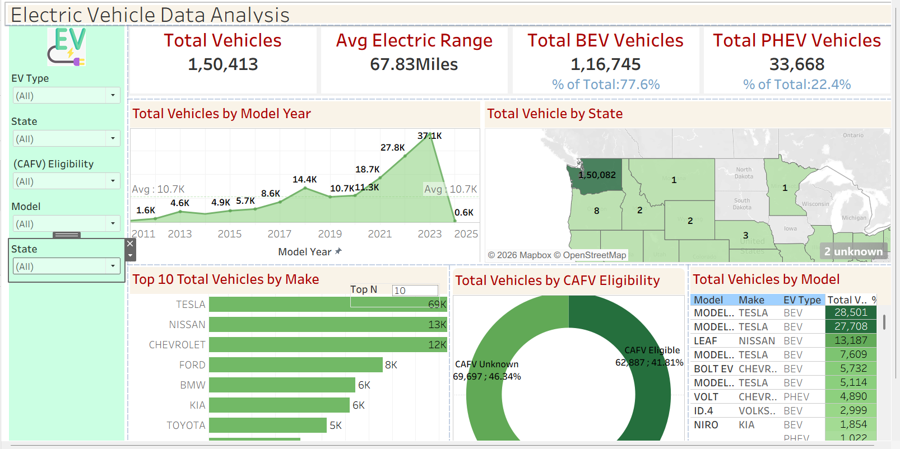

🚗 Electric Vehicle Adoption Analysis Dashboard
📌 Project Overview

This project presents an electric vehicle analysis dashboard developed to evaluate vehicle adoption trends, technology distribution, and geographic patterns using structured vehicle registration data. The dashboard applies data visualization techniques to identify growth trends across model years and support data-driven decision-making in the electric vehicle ecosystem.

🎯 Objectives

Analyze total electric vehicle adoption trends
Compare Battery Electric Vehicles (BEV) and Plug-in Hybrid Electric Vehicles (PHEV)
Identify top vehicle manufacturers
Evaluate average electric driving range
Monitor geographic distribution of electric vehicles
Support data-driven insights using interactive dashboards

📊 Key Metrics

Metric	Description
Total Vehicles	Total number of electric vehicles in the dataset
Total BEV	Number of Battery Electric Vehicles
Total PHEV	Number of Plug-in Hybrid Electric Vehicles
Average Electric Range	Average distance vehicles can travel using battery power
Top Manufacturers	Manufacturers with the highest number of vehicles
CAFV Eligibility	Vehicles eligible for clean alternative fuel programs

📈 Dashboard Features

Electric vehicle growth trend analysis by model year
Manufacturer performance comparison
Geographic distribution of vehicles by state
Clean fuel eligibility distribution analysis
Interactive filtering by vehicle type, year, and manufacturer
Dynamic dashboard exploration using parameters

🛠️ Tools and Technologies

Tableau
Microsoft Excel
Data Cleaning and Transformation
Data Visualization
Business Intelligence
Dashboard Development

🖼️ Dashboard Preview

Electric Vehicle Dashboard

📌 Business Value

Supports monitoring of electric vehicle adoption trends
Helps identify leading vehicle manufacturers
Improves understanding of regional adoption patterns
Enables data-driven planning and reporting
Assists stakeholders in evaluating clean energy adoption

🚀 Future Improvements

Predictive analysis for future electric vehicle adoption
Integration of real-time vehicle registration data
Analysis of charging infrastructure availability
Advanced analytics using machine learning models

📂 Project Structure

Electric-Vehicle-Analysis/
│
├── Electric_Vehicle_Analysis.twb
├── ev_dataset.xlsx
├── dashboard_screenshot.png
└── README.md

👤 Author

Hiba Fathima Y
Data Analyst / Data Science Enthusiast
